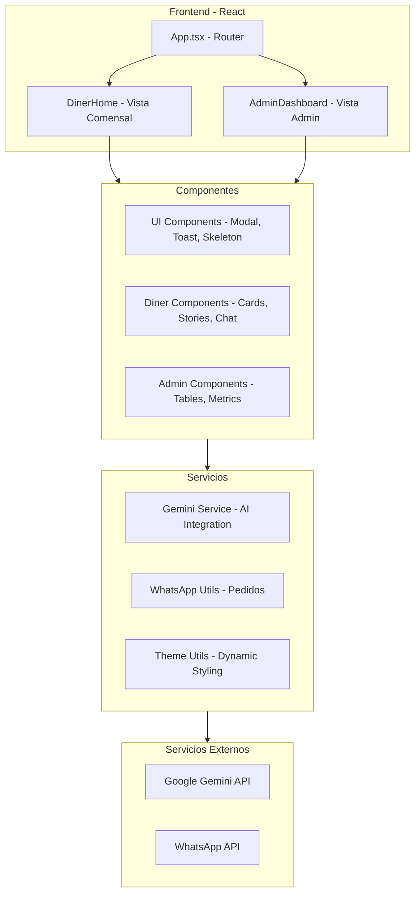

<div align="center">
  
  
  <h1 style="font-size: 3rem; font-weight: 700; margin-top: 1rem;">🍽️ MenuOS</h1>
  <p style="font-size: 1.2rem; opacity: 0.8;">Plataforma SaaS de Menús Digitales con IA para Restaurantes</p>
  
  
  
  
  
  
  
</div>

---

## 📖 Tabla de Contenidos

- [Descripción](#-descripción)
- [Características Principales](#-características-principales)
- [Arquitectura del Sistema](#-arquitectura-del-sistema)
- [Stack Tecnológico](#-stack-tecnológico)
- [Instalación y Configuración](#-instalación-y-configuración)
- [Estructura del Proyecto](#-estructura-del-proyecto)
- [Módulos Principales](#-módulos-principales)
- [Sistema Multi-Tenant](#-sistema-multi-tenant)
- [Integración con Gemini AI](#-integración-con-gemini-ai)
- [API y Servicios](#api-y-servicios)
- [Componentes UI](#componentes-ui)
- [Hooks Personalizados](#hooks-personalizados)
- [Rutas y Navegación](#rutas-y-navegación)
- [Personalización de Temas](#personalización-de-temas)
- [Scripts Disponibles](#scripts-disponibles)
- [Roadmap](#-roadmap)
- [Contribución](#-contribución)

---

## 🎯 Descripción

**MenuOS** es una plataforma de menús digitales diseñada para restaurantes modernos. Combina una experiencia de usuario premium con capacidades avanzadas de inteligencia artificial para ofrecer:

- **Experiencias de menú interactivas** con diseño tipo app móvil
- **Asistente virtual (Concierge)** impulsado por Gemini AI
- **Sistema multi-tenant** para gestionar múltiples restaurantes
- **Panel de administración** con herramientas de IA para gestión de menús
- **Pedidos vía WhatsApp** integrados

---

## ✨ Características Principales

### Para Comensales (Diner)
| Característica | Descripción |
|----------------|-------------|
| 🎨 **Diseño Premium** | Interfaz oscura elegante con animaciones fluidas |
| 📱 **Stories de Instagram** | Sistema de stories para promociones y destacados |
| 🛒 **Carrito Inteligente** | Selección con modificadores y personalización |
| 🤖 **Concierge AI** | Chatbot para recomendaciones y consultas |
| 💬 **Pedidos WhatsApp** | Envío directo de pedidos por WhatsApp |
| 🔍 **Búsqueda y Filtros** | Filtrado por categorías y búsqueda en tiempo real |
| ❤️ **Favoritos** | Sistema de likes con persistencia en sesión |
| 🍷 **Maridajes** | Sugerencias de maridaje para cada plato |

### Para Administradores
| Característica | Descripción |
|----------------|-------------|
| 📊 **Dashboard de Métricas** | Visualización de estadísticas del menú |
| 🪄 **Generación de Descripciones** | IA crea descripciones apetitosas automáticamente |
| 🖼️ **Generación de Imágenes** | Creación de imágenes de platos con IA |
| ✏️ **Edición de Imágenes** | Modificación de imágenes existentes |
| 📈 **Análisis de Menú** | Score de salud del menú con sugerencias |

---

## 🏗️ Arquitectura del Sistema



---

## 🛠️ Stack Tecnológico

| Categoría | Tecnología | Versión |
|-----------|------------|---------|
| **Framework** | Next.js | 16.1 (App Router) |
| **Lenguaje** | TypeScript | 5.8.2 |
| **Backend** | Supabase | PostgreSQL + Auth |
| **IA** | OpenRouter | Multi-modelo |
| **Iconos** | Lucide React | 0.563.0 |
| **Estilos** | Tailwind CSS | 4.x |
| **Fuentes** | Google Fonts | Inter, Playfair Display |

---

## 🚀 Instalación y Configuración

### Prerrequisitos

- **Node.js** >= 18.x
- **npm** o **yarn**
- **Cuenta de Supabase** ([Crear aquí](https://supabase.com))
- **API Key de OpenRouter** ([Obtener aquí](https://openrouter.ai/keys))

### Pasos de Instalación

```bash
# 1. Clonar el repositorio
git clone https://github.com/Math-300/menus-ia.git
cd menus-ia

# 2. Instalar dependencias
npm install

# 3. Crear archivo de variables de entorno
cp .env.example .env.local

# 4. Configurar variables de entorno (ver sección below)

# 5. Iniciar servidor de desarrollo
npm run dev
```

### Variables de Entorno

| Variable | Descripción | Requerido |
|----------|-------------|-----------|
| `NEXT_PUBLIC_SUPABASE_URL` | URL del proyecto Supabase | ✅ Sí |
| `NEXT_PUBLIC_SUPABASE_ANON_KEY` | Clave anónima de Supabase | ✅ Sí |
| `SUPABASE_SERVICE_ROLE_KEY` | Clave de servicio de Supabase | ✅ Sí |
| `OPENROUTER_API_KEY` | API Key de OpenRouter | ✅ Sí |
| `NEXT_PUBLIC_APP_URL` | URL de la aplicación | Opcional |

---

## 📁 Estructura del Proyecto

```
menuos/
├── 📂 src/
│   ├── 📂 app/                    # Next.js App Router
│   │   ├── layout.tsx             # Layout raíz
│   │   ├── page.tsx               # Página principal
│   │   ├── providers.tsx          # Providers de React
│   │   │
│   │   ├── 📂 (auth)/             # Grupo de rutas auth
│   │   │   └── 📂 login/          # Página de login
│   │   │
│   │   ├── 📂 (tenant)/           # Grupo de rutas tenant
│   │   │   └── 📂 [slug]/         # Ruta dinámica por restaurante
│   │   │
│   │   ├── 📂 admin/              # Panel de administración
│   │   │   ├── layout.tsx
│   │   │   └── page.tsx
│   │   │
│   │   └── 📂 api/                # API Routes
│   │       └── 📂 ai/             # Endpoints de IA
│   │
│   ├── 📂 components/
│   │   ├── 📂 admin/              # Componentes del panel admin
│   │   │   ├── AdminImageGenModal.tsx
│   │   │   ├── AdminMenuTable.tsx
│   │   │   ├── AdminMetrics.tsx
│   │   │   └── AdminSidebar.tsx
│   │   │
│   │   ├── 📂 diner/              # Componentes para comensales
│   │   │   ├── ChatBot.tsx
│   │   │   ├── DinerClient.tsx
│   │   │   ├── DinerFooter.tsx
│   │   │   ├── DinerHeader.tsx
│   │   │   ├── DinerNavbar.tsx
│   │   │   ├── DishCard.tsx
│   │   │   ├── DishDetailModal.tsx
│   │   │   ├── HeroSection.tsx
│   │   │   ├── OrderSummaryModal.tsx
│   │   │   ├── SectionRow.tsx
│   │   │   ├── SelectionDock.tsx
│   │   │   ├── StoryRail.tsx
│   │   │   └── StoryViewer.tsx
│   │   │
│   │   └── 📂 ui/                 # Componentes UI reutilizables
│   │       ├── Modal.tsx
│   │       ├── Skeleton.tsx
│   │       └── Toast.tsx
│   │
│   ├── 📂 lib/
│   │   ├── 📂 ai/                 # Integración IA
│   │   │   ├── openrouter.ts      # Cliente OpenRouter
│   │   │   ├── chatService.ts     # Servicio de chat
│   │   │   └── prompts.ts         # Prompts del sistema
│   │   │
│   │   ├── 📂 supabase/           # Cliente Supabase
│   │   │   ├── client.ts          # Cliente browser
│   │   │   ├── server.ts          # Cliente servidor
│   │   │   └── admin.ts           # Cliente admin
│   │   │
│   │   └── 📂 utils/              # Utilidades
│   │       ├── cn.ts              # Class names
│   │       ├── format.ts          # Formateo
│   │       ├── theme.ts           # Motor de temas
│   │       └── whatsapp.ts        # Links WhatsApp
│   │
│   ├── 📂 hooks/                  # Hooks personalizados
│   │   ├── useAdminAI.ts
│   │   ├── useCart.ts
│   │   └── useMenuFilter.ts
│   │
│   ├── 📂 data/
│   │   └── mockData.ts            # Datos de demo
│   │
│   ├── 📂 types/
│   │   ├── index.ts               # Tipos principales
│   │   └── database.ts            # Tipos de Supabase
│   │
│   └── middleware.ts              # Middleware de autenticación
│
├── 📂 contracts/
│   ├── openapi.yaml               # Contrato API OpenAPI
│   └── 📂 mocks/                  # Mocks para desarrollo
│
├── 📂 public/                     # Archivos estáticos
│
└── 📂 .github/
    └── PULL_REQUEST_TEMPLATE.md
```

---

## 🧩 Módulos Principales

### 1. Vista del Comensal ([`src/app/(tenant)/[slug]/page.tsx`](src/app/(tenant)/[slug]/page.tsx))

Página principal que integra:
- Header con información del restaurante
- Rail de Stories
- Navegación por categorías
- Grid de platos con cards
- Dock de selección flotante
- ChatBot concierge

### 2. Panel de Administración ([`src/app/admin/page.tsx`](src/app/admin/page.tsx))

Dashboard con:
- Métricas del menú
- Tabla de gestión de platos
- Modal de generación de imágenes
- Análisis de salud del menú

### 3. Sistema de Carrito ([`src/hooks/useCart.ts`](src/hooks/useCart.ts))

Hook personalizado que maneja:
- Adición de items con modificadores
- Actualización de cantidades
- Cálculo de precios finales
- Lógica de fusión de items idénticos

---

## 🏢 Sistema Multi-Tenant

MenuOS soporta múltiples restaurantes con configuraciones independientes:

### Estructura de Datos

```typescript
interface RestaurantData {
  config: RestaurantConfig;   // Configuración del restaurante
  menu: MenuItem[];           // Items del menú
  categories: Category[];     // Categorías personalizadas
  stories: Story[];           // Stories promocionales
}
```

### Restaurantes Demo Incluidos

| Slug | Nombre | Estilo |
|------|--------|--------|
| `demo-grill` | MenuOS Grill | Parrilla americana |
| `sushi-master` | Omakase Zen | Cocina japonesa |
| `green-eats` | Roots & Seeds | Plant-based |

### Rutas de Acceso

```
/demo-grill         → MenuOS Grill
/sushi-master       → Omakase Zen
/green-eats         → Roots & Seeds
/admin              → Panel de administración
/login              → Inicio de sesión
```

---

## 🤖 Integración con IA (OpenRouter)

### Capacidades de IA

MenuOS utiliza OpenRouter para acceder a múltiples modelos de IA:

| Función | Modelo | Descripción |
|---------|--------|-------------|
| `chatWithConcierge()` | openai/gpt-4o-mini | Chat con contexto del menú |
| `generateDishDescription()` | openai/gpt-4o-mini | Descripciones apetitosas |
| `analyzeMenuHealth()` | openai/gpt-4o-mini | Score y sugerencias |
| `getRecommendations()` | openai/gpt-4o-mini | Recomendaciones personalizadas |

### Sistema de Prompts ([`src/lib/ai/prompts.ts`](src/lib/ai/prompts.ts))

Los prompts están optimizados para español y tono de alta cocina:

```typescript
CONCIERGE_SYSTEM_INSTRUCTION: 
  "Eres MenuOS Concierge, un asistente gastronómico sofisticado..."
```

### API Routes

| Endpoint | Método | Descripción |
|----------|--------|-------------|
| `/api/ai/chat` | POST | Chat con el concierge |
| `/api/ai/generate-description` | POST | Generar descripción de plato |

---

## 🔌 API y Servicios

### Cliente Supabase ([`src/lib/supabase/`](src/lib/supabase/))

```typescript
// Cliente para componentes cliente
import { createBrowserClient } from '@/lib/supabase/client';

// Cliente para Server Components
import { createServerClient } from '@/lib/supabase/server';

// Cliente admin con service role
import { createAdminClient } from '@/lib/supabase/admin';
```

### Servicio OpenRouter ([`src/lib/ai/openrouter.ts`](src/lib/ai/openrouter.ts))

```typescript
// Ejemplo: Chat con el concierge
const response = await chatWithOpenRouter(
  "¿Qué vino recomiendas para el steak?",
  history,
  systemPrompt
);

// Ejemplo: Generar descripción
const description = await generateDescription(
  "Truffle Burger",
  "trufa, queso suizo, brioche"
);
```

### Utilidad WhatsApp ([`src/lib/utils/whatsapp.ts`](src/lib/utils/whatsapp.ts))

```typescript
// Generar link de pedido
const link = generateWhatsAppLink(
  cartItems,
  "MenuOS Grill",
  "$"
);
// Resultado: https://wa.me/573001234567?text=...
```

---

## 🎨 Componentes UI

### Componentes del Comensal

| Componente | Archivo | Descripción |
|------------|---------|-------------|
| `StoryRail` | [`StoryRail.tsx`](src/components/diner/StoryRail.tsx) | Barra de stories tipo Instagram |
| `StoryViewer` | [`StoryViewer.tsx`](src/components/diner/StoryViewer.tsx) | Visor de stories en pantalla completa |
| `DishCard` | [`DishCard.tsx`](src/components/diner/DishCard.tsx) | Tarjeta de plato con animaciones |
| `DishDetailModal` | [`DishDetailModal.tsx`](src/components/diner/DishDetailModal.tsx) | Modal de detalle con modificadores |
| `SelectionDock` | [`SelectionDock.tsx`](src/components/diner/SelectionDock.tsx) | Dock flotante del carrito |
| `ChatBot` | [`ChatBot.tsx`](src/components/diner/ChatBot.tsx) | Asistente virtual flotante |
| `OrderSummaryModal` | [`OrderSummaryModal.tsx`](src/components/diner/OrderSummaryModal.tsx) | Resumen de pedido |

### Componentes UI Base

| Componente | Archivo | Descripción |
|------------|---------|-------------|
| `Modal` | [`Modal.tsx`](src/components/ui/Modal.tsx) | Modal base reutilizable |
| `Toast` | [`Toast.tsx`](src/components/ui/Toast.tsx) | Notificaciones toast |
| `Skeleton` | [`Skeleton.tsx`](src/components/ui/Skeleton.tsx) | Placeholders de carga |

---

## 🪝 Hooks Personalizados

### [`useCart`](src/hooks/useCart.ts)

Gestión completa del carrito de compras:

```typescript
const { 
  selection,        // Items en el carrito
  addToCart,        // Agregar item
  updateQuantity,   // Cambiar cantidad
  removeFromCart,   // Eliminar item
  clearCart         // Vaciar carrito
} = useCart();
```

### [`useMenuFilter`](src/hooks/useMenuFilter.ts)

Filtrado y búsqueda del menú:

```typescript
const {
  selectedCategory,     // Categoría activa
  setSelectedCategory,  // Cambiar categoría
  searchQuery,          // Query de búsqueda
  setSearchQuery,       // Actualizar búsqueda
  filteredItems         // Items filtrados
} = useMenuFilter(menuItems);
```

### [`useAdminAI`](src/hooks/useAdminAI.ts)

Funciones de IA para el panel admin:

```typescript
const {
  loadingId,              // ID del item procesándose
  analyzing,              // Estado de análisis
  healthScore,            // Score del menú
  handleGenerateDescription,
  handleGenerateImage,
  handleEditImage,
  handleMenuAnalysis
} = useAdminAI(items, setItems, hasApiKey);
```

---

## 🧭 Rutas y Navegación

El routing se maneja con el hash de URL:

```typescript
// En App.tsx
const route = window.location.hash;

// Patrones de ruta:
'/'              → Redirección a demo-grill
'#/r/:slug'       → Vista de restaurante
'#/restaurante/:slug' → Alternativa en español
'#/admin'         → Panel de administración
```

### Navegación Programática

```typescript
// Cambiar de restaurante
window.location.hash = '#/r/sushi-master';

// Ir al admin
window.location.hash = '#/admin';
```

---

## 🎨 Personalización de Temas

### Motor de Temas Dinámico ([`theme.ts`](utils/theme.ts))

Cada restaurante puede tener su propia paleta y tipografía:

```typescript
interface RestaurantTheme {
  colors: {
    primary: string;   // Color principal de marca
    secondary: string; // Elementos secundarios
    accent: string;    // CTAs y destacados
    dark: string;      // Fondos oscuros
  };
  fonts: {
    sans: string;      // Fuente sans-serif
    serif: string;     // Fuente serif
  };
}
```

### Aplicación Automática

```typescript
// Se aplica automáticamente al cargar un restaurante
applyTheme(restaurantData.config.theme);

// Las variables CSS quedan disponibles:
// --color-brand-primary
// --color-brand-secondary
// --color-brand-accent
// --color-brand-dark
```

---

## 📜 Scripts Disponibles

| Comando | Descripción |
|---------|-------------|
| `npm run dev` | Servidor de desarrollo en puerto 3000 |
| `npm run build` | Build de producción |
| `npm run preview` | Preview del build |

---

## 🗺️ Roadmap

### v1.0 (Actual)
- [x] Sistema multi-tenant
- [x] Integración Gemini AI
- [x] Panel de administración
- [x] Carrito con modificadores
- [x] Pedidos WhatsApp

### v1.1 (Próximo)
- [ ] Autenticación con Supabase
- [ ] Persistencia de datos
- [ ] Panel de métricas real
- [ ] Notificaciones push

### v1.2 (Futuro)
- [ ] Pagos con Stripe
- [ ] App móvil nativa
- [ ] Multi-idioma
- [ ] Analytics avanzados

---

## 🤝 Contribución

Las contribuciones son bienvenidas. Por favor, lee las guías de colaboración en [`docs/ANALYSIS-COLLABORATION-GUIDE.md`](docs/ANALYSIS-COLLABORATION-GUIDE.md).

---

<div align="center">
  <p>Hecho con ❤️ por el equipo de MenuOS</p>
  <p>© 2024 MenuOS. Todos los derechos reservados.</p>
</div>
