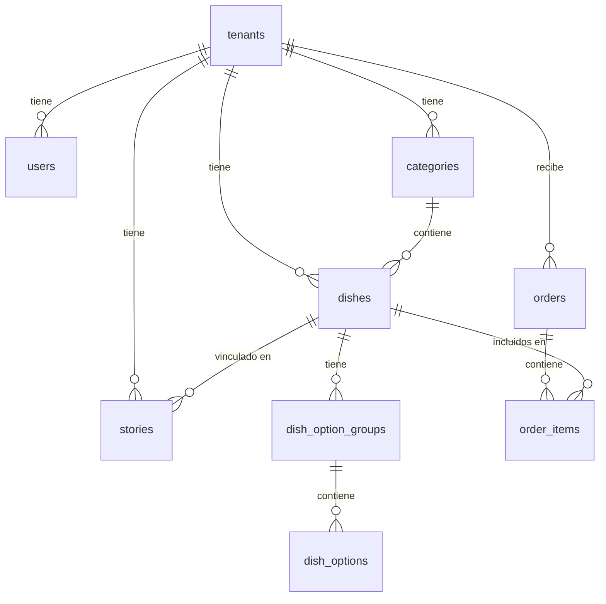
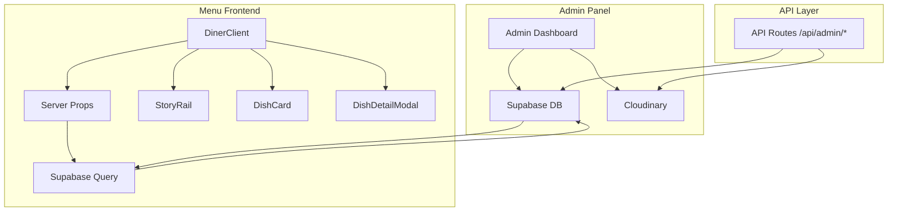

# Diseño del Panel de Administración - MenuOS

## Resumen Ejecutivo

Este documento define la estructura completa del panel de administración conectado con todos los componentes del menú digital. El admin permitirá gestionar: configuración del restaurante, categorías, platos, stories, pedidos y análisis.

---

## 1. Análisis de Componentes Actuales

### 1.1 Componentes del Menú (Frontend Diner)

| Componente | Ubicación | Props/Data | Conexión DB |
|------------|-----------|------------|-------------|
| [`DinerClient.tsx`](../src/components/diner/DinerClient.tsx) | Main container | `config`, `menuItems`, `stories`, `categories` | Todas las tablas |
| [`StoryRail.tsx`](../src/components/diner/StoryRail.tsx) | Stories carousel | `stories[]` con id, title, image, viewed, type | `stories` |
| [`DishCard.tsx`](../src/components/diner/DishCard.tsx) | Dish cards | `item` con name, price, image, category, tags, popular, chefChoice | `dishes` |
| [`DishDetailModal.tsx`](../src/components/diner/DishDetailModal.tsx) | Detail modal | `item` con modifiers, pairing, ingredients | `dishes` + `dish_option_groups` + `dish_options` |
| [`HeroSection.tsx`](../src/components/diner/HeroSection.tsx) | Featured dish | `item` destacado | `dishes` (is_popular) |
| [`SectionRow.tsx`](../src/components/diner/SectionRow.tsx) | Category rows | `items[]` filtrados por categoría | `dishes` + `categories` |
| [`DinerHeader.tsx`](../src/components/diner/DinerHeader.tsx) | Header con logo | `config` con name, logo, tagline | `tenants` |
| [`DinerNavbar.tsx`](../src/components/diner/DinerNavbar.tsx) | Navegación | `categories[]` para filtros | `categories` |

### 1.2 Estructura de Datos (mockData.ts)

```typescript
// Estructura principal que consume el menú
interface RestaurantData {
  config: RestaurantConfig;     // → tenants table
  categories: Category[];       // → categories table
  stories: Story[];             // → stories table
  menu: MenuItem[];             // → dishes table
}
```

---

## 2. Tablas de Supabase Disponibles

### 2.1 Diagrama Entidad-Relación



### 2.2 Detalle de Tablas

| Tabla | Registros | Propósito Admin | Campos Clave |
|-------|-----------|-----------------|--------------|
| `tenants` | 3 | Configuración del restaurante | slug, name, logo_url, primary_color, currency |
| `users` | 3 | Gestión de usuarios admin | email, full_name, role |
| `categories` | 15 | Categorías del menú | name, slug, display_order, is_active |
| `dishes` | 34 | Platos del menú | name, price, image_url, is_popular, is_chef_choice |
| `dish_option_groups` | 4 | Grupos de modificadores | name, min_selections, max_selections |
| `dish_options` | 14 | Opciones de modificadores | name, price, available |
| `stories` | 9 | Stories promocionales | title, type, image_url, linked_dish_id |
| `orders` | 0 | Pedidos recibidos | status, total, payment_status |
| `order_items` | 0 | Items de cada pedido | dish_name, quantity, unit_price |

---

## 3. Secciones del Panel de Administración

### 3.1 Arquitectura de Navegación

```
/admin
├── 📊 Dashboard          → /admin/dashboard
├── 🍽️ Menú               → /admin/menu
│   ├── Categorías        → /admin/menu/categories
│   ├── Platos            → /admin/menu/dishes
│   └── Modificadores     → /admin/menu/modifiers
├── 📸 Stories            → /admin/stories
├── 🎨 Branding           → /admin/branding
├── 📦 Pedidos            → /admin/orders
├── 📈 Analíticas         → /admin/analytics
└── ⚙️ Configuración      → /admin/settings
```

### 3.2 Detalle por Sección

#### 📊 Dashboard
**Propósito:** Vista general del estado del restaurante

**Componentes:**
- Métricas rápidas: Total platos, Stories activos, Pedidos pendientes
- Gráfico de ventas (si hay pedidos)
- Alertas: Platos sin imagen, Stories por expirar
- Accesos rápidos a acciones frecuentes

**Tablas involucradas:** `tenants`, `dishes`, `stories`, `orders`

---

#### 🍽️ Menú (Catálogo)
**Propósito:** Gestión completa del catálogo de platos

**Sub-secciones:**

##### Categorías
- CRUD completo de categorías
- Drag & drop para reordenar
- Activar/desactivar categorías
- Asignar imagen de portada

**Mapeo a componentes:**
- [`DinerNavbar.tsx`](../src/components/diner/DinerNavbar.tsx) - Filtros de navegación
- [`SectionRow.tsx`](../src/components/diner/SectionRow.tsx) - Secciones de platos

**APIs necesarias:**
```
GET    /api/admin/categories      → Listar categorías
POST   /api/admin/categories      → Crear categoría
PATCH  /api/admin/categories/:id  → Actualizar categoría
DELETE /api/admin/categories/:id  → Eliminar categoría
PUT    /api/admin/categories/reorder → Reordenar categorías
```

##### Platos
- CRUD completo de platos
- Editor de modificadores integrado
- Gestión de imagen con Cloudinary
- Flags: popular, nuevo, chef_choice, disponible
- Vista previa en tiempo real

**Mapeo a componentes:**
- [`DishCard.tsx`](../src/components/diner/DishCard.tsx) - Tarjetas de platos
- [`DishDetailModal.tsx`](../src/components/diner/DishDetailModal.tsx) - Detalle con modificadores
- [`HeroSection.tsx`](../src/components/diner/HeroSection.tsx) - Plato destacado

**APIs necesarias:**
```
GET    /api/admin/dishes          → Listar platos (con filtros)
GET    /api/admin/dishes/:id      → Detalle de plato
POST   /api/admin/dishes          → Crear plato
PATCH  /api/admin/dishes/:id      → Actualizar plato
DELETE /api/admin/dishes/:id      → Eliminar plato
POST   /api/admin/dishes/:id/image → Subir imagen
```

##### Modificadores
- Gestión de grupos de opciones
- Opciones dentro de cada grupo
- Precios adicionales por opción
- Disponibilidad de opciones

**Mapeo a componentes:**
- [`DishDetailModal.tsx`](../src/components/diner/DishDetailModal.tsx:139) - `toggleSelection()`

**APIs necesarias:**
```
GET    /api/admin/modifiers              → Listar grupos
POST   /api/admin/modifiers              → Crear grupo
PATCH  /api/admin/modifiers/:id          → Actualizar grupo
DELETE /api/admin/modifiers/:id          → Eliminar grupo
POST   /api/admin/modifiers/:id/options  → Agregar opción
PATCH  /api/admin/modifiers/options/:id  → Actualizar opción
DELETE /api/admin/modifiers/options/:id  → Eliminar opción
```

---

#### 📸 Stories
**Propósito:** Gestión de stories tipo Instagram

**Funcionalidades:**
- CRUD de stories
- Tipos: dish, promo, chef, event
- Vincular story a plato específico
- Programar expiración
- Vista previa de story
- Contador de visualizaciones

**Mapeo a componentes:**
- [`StoryRail.tsx`](../src/components/diner/StoryRail.tsx) - Carrusel de stories
- [`StoryViewer.tsx`](../src/components/diner/StoryViewer.tsx) - Visor de stories

**APIs necesarias:**
```
GET    /api/admin/stories         → Listar stories
POST   /api/admin/stories         → Crear story
PATCH  /api/admin/stories/:id     → Actualizar story
DELETE /api/admin/stories/:id     → Eliminar story
```

---

#### 🎨 Branding
**Propósito:** Personalización visual del menú

**Funcionalidades:**
- Logo del restaurante
- Colores: primary, secondary, accent
- Fuente: sans, serif
- Imagen de portada/cover
- Tagline y descripción
- Moneda y locale

**Mapeo a componentes:**
- [`DinerHeader.tsx`](../src/components/diner/DinerHeader.tsx) - Logo y nombre
- [`DinerClient.tsx`](../src/components/diner/DinerClient.tsx:146) - Background y colores
- Todos los componentes usan `config.theme`

**APIs necesarias:**
```
GET   /api/admin/branding         → Obtener configuración
PATCH /api/admin/branding         → Actualizar configuración
POST  /api/admin/branding/logo    → Subir logo
POST  /api/admin/branding/cover   → Subir cover
```

---

#### 📦 Pedidos
**Propósito:** Gestión de pedidos recibidos

**Funcionalidades:**
- Lista de pedidos con filtros por estado
- Detalle de cada pedido
- Cambiar estado: pending → confirmed → preparing → ready → delivered
- Historial de pedidos
- Integración con Wompi (pagos)

**Estados de pedido:**
```
pending → confirmed → preparing → ready → delivered
                ↓
            cancelled
```

**APIs necesarias:**
```
GET    /api/admin/orders          → Listar pedidos
GET    /api/admin/orders/:id      → Detalle de pedido
PATCH  /api/admin/orders/:id      → Actualizar estado
```

---

#### 📈 Analíticas
**Propósito:** Métricas y reportes

**Funcionalidades:**
- Platos más vendidos
- Categorías populares
- Horarios de mayor actividad
- Tasa de conversión de stories
- Revenue tracking

**APIs necesarias:**
```
GET /api/admin/analytics/overview    → Resumen general
GET /api/admin/analytics/dishes      → Top platos
GET /api/admin/analytics/categories  → Performance por categoría
GET /api/admin/analytics/stories     → Engagement de stories
```

---

#### ⚙️ Configuración
**Propósito:** Ajustes del sistema

**Funcionalidades:**
- Información del negocio (dirección, horarios, contacto)
- Configuración de WhatsApp
- Integraciones (Wompi, Cloudinary)
- Usuarios administradores
- Plan y facturación

**APIs necesarias:**
```
GET   /api/admin/settings        → Obtener configuración
PATCH /api/admin/settings        → Actualizar configuración
GET   /api/admin/users           → Listar usuarios
POST  /api/admin/users           → Invitar usuario
DELETE /api/admin/users/:id      → Eliminar usuario
```

---

## 4. Conexión con Componentes del Menú

### 4.1 Flujo de Datos



### 4.2 Mapeo de Props a Tablas

| Prop en Componente | Tabla Source | Campo |
|--------------------|--------------|-------|
| `config.name` | `tenants` | `name` |
| `config.logo` | `tenants` | `logo_url` |
| `config.theme.colors.primary` | `tenants` | `primary_color` |
| `config.currency` | `tenants` | `currency` |
| `categories[]` | `categories` | `name`, `slug`, `display_order` |
| `stories[].title` | `stories` | `title` |
| `stories[].image` | `stories` | `image_url` |
| `stories[].type` | `stories` | `type` (enum) |
| `menuItems[].name` | `dishes` | `name` |
| `menuItems[].price` | `dishes` | `price` |
| `menuItems[].image` | `dishes` | `image_url` |
| `menuItems[].popular` | `dishes` | `is_popular` |
| `menuItems[].chefChoice` | `dishes` | `is_chef_choice` |
| `menuItems[].modifiers` | `dish_option_groups` + `dish_options` | Join query |

### 4.3 Query de Carga del Menú

```sql
-- Query principal para cargar datos del menú
WITH tenant_data AS (
    SELECT * FROM tenants WHERE slug = $1
),
categories_data AS (
    SELECT * FROM categories 
    WHERE tenant_id = (SELECT id FROM tenant_data) AND is_active = true
    ORDER BY display_order
),
stories_data AS (
    SELECT s.*, d.name as linked_dish_name
    FROM stories s
    LEFT JOIN dishes d ON s.linked_dish_id = d.id
    WHERE s.tenant_id = (SELECT id FROM tenant_data) AND s.is_active = true
),
dishes_data AS (
    SELECT 
        d.*,
        c.name as category_name,
        COALESCE(
            json_agg(
                json_build_object(
                    'id', g.id,
                    'name', g.name,
                    'minSelection', g.min_selections,
                    'maxSelection', g.max_selections,
                    'options', (
                        SELECT json_agg(
                            json_build_object(
                                'id', o.id,
                                'name', o.name,
                                'price', o.price,
                                'available', o.available
                            )
                        ) FROM dish_options o WHERE o.group_id = g.id
                    )
                )
            ) FILTER (WHERE g.id IS NOT NULL), '[]'
        ) as modifiers
    FROM dishes d
    LEFT JOIN categories c ON d.category_id = c.id
    LEFT JOIN dish_option_groups g ON g.dish_id = d.id
    WHERE d.tenant_id = (SELECT id FROM tenant_data)
    GROUP BY d.id, c.name
)
SELECT 
    (SELECT row_to_json(t) FROM tenant_data t) as config,
    (SELECT json_agg(row_to_json(c)) FROM categories_data c) as categories,
    (SELECT json_agg(row_to_json(s)) FROM stories_data s) as stories,
    (SELECT json_agg(row_to_json(d)) FROM dishes_data d) as menu;
```

---

## 5. APIs Necesarias

### 5.1 Estructura de Rutas

```
/src/app/api/admin/
├── categories/
│   └── route.ts              # GET, POST
├── categories/[id]/
│   └── route.ts              # PATCH, DELETE
├── dishes/
│   └── route.ts              # GET, POST
├── dishes/[id]/
│   └── route.ts              # GET, PATCH, DELETE
├── dishes/[id]/image/
│   └── route.ts              # POST (upload)
├── modifiers/
│   └── route.ts              # GET, POST
├── modifiers/[id]/
│   └── route.ts              # PATCH, DELETE
├── stories/
│   └── route.ts              # GET, POST
├── stories/[id]/
│   └── route.ts              # PATCH, DELETE
├── branding/
│   └── route.ts              # GET, PATCH
├── orders/
│   └── route.ts              # GET
├── orders/[id]/
│   └── route.ts              # GET, PATCH
├── analytics/
│   └── route.ts              # GET (agregaciones)
└── settings/
    └── route.ts              # GET, PATCH
```

### 5.2 Middleware de Autenticación

Todas las rutas `/api/admin/*` deben:
1. Verificar sesión de Supabase Auth
2. Obtener `tenant_id` del usuario autenticado
3. Aplicar RLS automáticamente

---

## 6. Plan de Implementación

### Fase 1: Infraestructura Base
- [ ] Crear layout de admin con navegación completa
- [ ] Implementar middleware de autenticación
- [ ] Crear componentes base: DataTable, Forms, Modals
- [ ] Configurar React Query para cache de datos

### Fase 2: Gestión de Menú
- [ ] CRUD de Categorías con drag & drop
- [ ] CRUD de Platos con formulario completo
- [ ] Editor de Modificadores
- [ ] Integración con Cloudinary para imágenes

### Fase 3: Stories y Branding
- [ ] CRUD de Stories con vista previa
- [ ] Editor de Branding con preview en tiempo real
- [ ] Upload de logo y cover

### Fase 4: Pedidos y Analíticas
- [ ] Lista de pedidos con filtros
- [ ] Dashboard de analíticas
- [ ] Integración con Wompi

### Fase 5: Conexión con Frontend
- [ ] Actualizar [`page.tsx`](../src/app/(tenant)/[slug]/page.tsx) para usar Supabase
- [ ] Crear Server Components para carga de datos
- [ ] Implementar ISR (Incremental Static Regeneration)

---

## 7. Consideraciones Técnicas

### 7.1 Seguridad
- RLS habilitado en todas las tablas
- Verificación de `tenant_id` en cada operación
- Sanitización de inputs con Zod

### 7.2 Performance
- React Query para cache del lado cliente
- Server Components para carga inicial
- Optimistic updates para acciones frecuentes
- Debounce en búsquedas y filtros

### 7.3 UX
- Toast notifications para feedback
- Skeleton loading states
- Confirmación antes de eliminar
- Undo para acciones destructivas

---

## 8. Próximos Pasos

1. **Revisar y aprobar** este documento
2. **Crear issues** en GitHub para cada fase
3. **Implementar Fase 1** (Infraestructura Base)
4. **Iterar** con feedback del usuario
