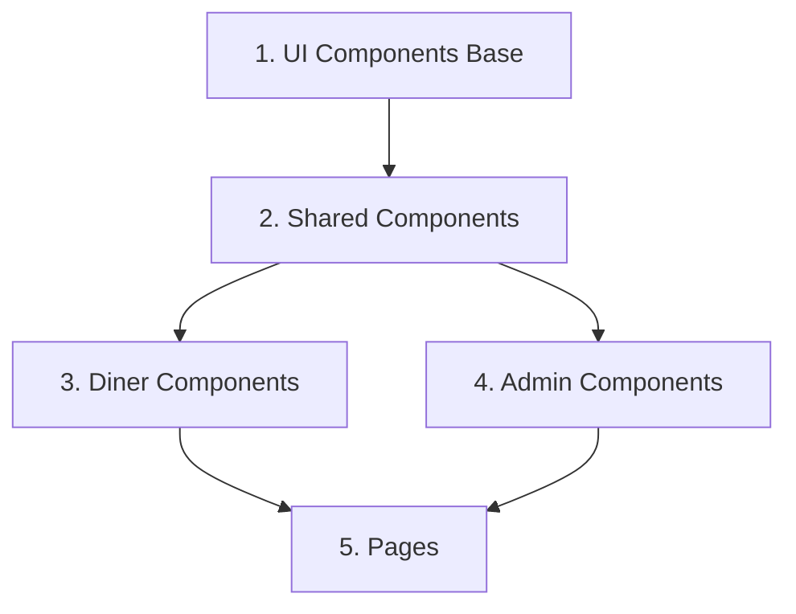
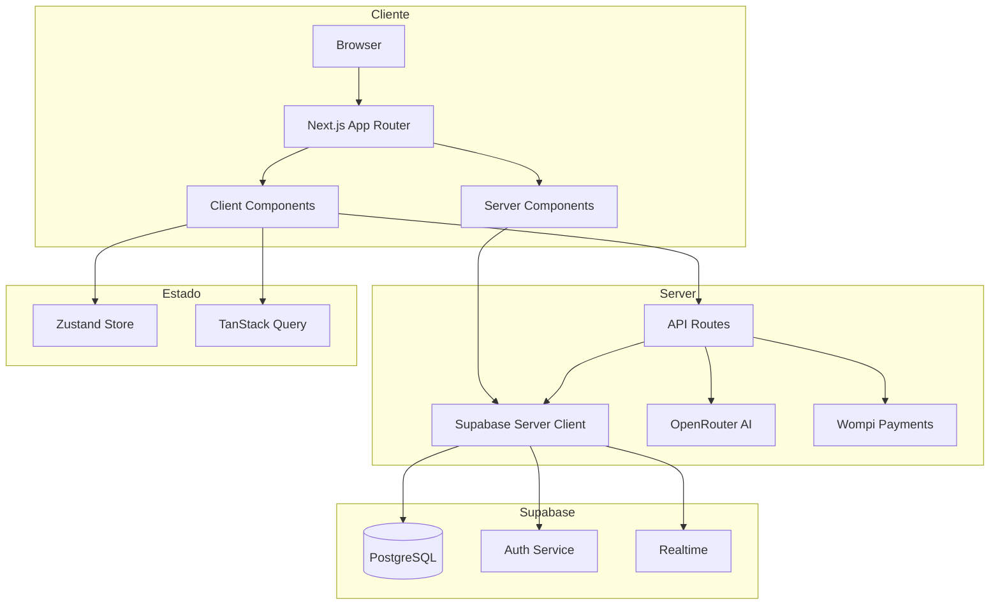

# Plan de Migración: Vite + React 19 → Next.js 15

## Resumen Ejecutivo

Este documento detalla la migración completa del proyecto MenuOS desde Vite + React 19 hacia Next.js 15 con App Router, incluyendo la integración de Supabase, OpenRouter, y Wompi.

### Estado Actual
- **Framework**: Vite 6.2 + React 19.2
- **Routing**: Hash-based (`#/admin`, `#/r/:slug`)
- **IA**: Google Gemini API
- **Estado**: React useState local
- **Datos**: Mock data estático

### Estado Objetivo
- **Framework**: Next.js 15 (App Router + RSC)
- **Routing**: File-based con dynamic routes
- **IA**: OpenRouter API
- **Estado**: Zustand + TanStack Query
- **Datos**: Supabase (PostgreSQL + Realtime)

---

## Fase 1: Setup Inicial

### 1.1 Crear Proyecto Next.js 15

```bash
# Crear nuevo proyecto en directorio separado
npx create-next-app@latest menuos-next --typescript --tailwind --eslint --app --src-dir --import-alias "@/*"

# Opciones recomendadas:
# - TypeScript: Yes
# - ESLint: Yes
# - Tailwind CSS: Yes
# - `src/` directory: Yes
# - App Router: Yes
# - Turbopack: Yes (para dev más rápido)
# - Import alias: @/*
```

### 1.2 Configurar TypeScript Strict

```jsonc
// tsconfig.json
{
  "compilerOptions": {
    "target": "ES2022",
    "lib": ["dom", "dom.iterable", "esnext"],
    "allowJs": true,
    "skipLibCheck": true,
    "strict": true,
    "noEmit": true,
    "esModuleInterop": true,
    "module": "esnext",
    "moduleResolution": "bundler",
    "resolveJsonModule": true,
    "isolatedModules": true,
    "jsx": "preserve",
    "incremental": true,
    "plugins": [
      {
        "name": "next"
      }
    ],
    "paths": {
      "@/*": ["./src/*"]
    },
    // Strict mode additions
    "noUncheckedIndexedAccess": true,
    "noImplicitReturns": true,
    "noFallthroughCasesInSwitch": true,
    "noUnusedLocals": true,
    "noUnusedParameters": true,
    "exactOptionalPropertyTypes": true
  },
  "include": ["next-env.d.ts", "**/*.ts", "**/*.tsx", ".next/types/**/*.ts"],
  "exclude": ["node_modules"]
}
```

### 1.3 Instalar Dependencias Core

```bash
# Dependencias de producción
npm install @supabase/supabase-js @supabase/ssr
npm install zustand @tanstack/react-query
npm install framer-motion
npm install lucide-react
npm install clsx tailwind-merge class-variance-authority
npm install openai  # Para OpenRouter compatibility

# shadcn/ui setup
npx shadcn@latest init

# Componentes shadcn/ui necesarios
npx shadcn@latest add button
npx shadcn@latest add card
npx shadcn@latest add dialog
npx shadcn@latest add input
npx shadcn@latest add toast
npx shadcn@latest add skeleton
npx shadcn@latest add badge
npx shadcn@latest add sheet
npx shadcn@latest add dropdown-menu

# Dependencias de desarrollo
npm install -D @types/node
npm install -D tailwindcss-animate
```

### 1.4 Configurar Tailwind CSS

```typescript
// tailwind.config.ts
import type { Config } from 'tailwindcss'

const config: Config = {
  darkMode: ['class'],
  content: [
    './src/pages/**/*.{js,ts,jsx,tsx,mdx}',
    './src/components/**/*.{js,ts,jsx,tsx,mdx}',
    './src/app/**/*.{js,ts,jsx,tsx,mdx}',
  ],
  theme: {
    extend: {
      colors: {
        brand: {
          primary: 'var(--brand-primary)',
          secondary: 'var(--brand-secondary)',
          accent: 'var(--brand-accent)',
        },
      },
      fontFamily: {
        sans: ['Inter', 'sans-serif'],
        serif: ['Playfair Display', 'serif'],
      },
      animation: {
        'fade-in': 'fadeIn 0.3s ease-out',
        'slide-up': 'slideUp 0.4s ease-out',
        'spin-slow': 'spin 3s linear infinite',
      },
      keyframes: {
        fadeIn: {
          '0%': { opacity: '0' },
          '100%': { opacity: '1' },
        },
        slideUp: {
          '0%': { transform: 'translateY(100%)', opacity: '0' },
          '100%': { transform: 'translateY(0)', opacity: '1' },
        },
      },
    },
  },
  plugins: [require('tailwindcss-animate')],
}
export default config
```

### 1.5 Variables de Entorno

```bash
# .env.local
# Supabase
NEXT_PUBLIC_SUPABASE_URL=https://xxx.supabase.co
NEXT_PUBLIC_SUPABASE_ANON_KEY=eyJxxx
SUPABASE_SERVICE_ROLE_KEY=eyJxxx

# OpenRouter
OPENROUTER_API_KEY=sk-or-xxx
OPENROUTER_DEFAULT_MODEL=anthropic/claude-3-haiku

# Wompi
NEXT_PUBLIC_WOMPI_PUBLIC_KEY=pub_test_xxx
WOMPI_PRIVATE_KEY=prv_test_xxx
WOMPI_INTEGRITY_SECRET=test_integrity_xxx

# App
NEXT_PUBLIC_APP_URL=http://localhost:3000
```

---

## Fase 2: Estructura de Directorios

### 2.1 Mapeo de Estructura

```
ESTRUCTURA ACTUAL (Vite)          →    ESTRUCTURA NUEVA (Next.js 15)
================================================================
App.tsx                           →    src/app/layout.tsx + routing
index.tsx                         →    (eliminado - Next.js maneja entry)
                                  →    src/app/page.tsx (redirect)

components/
├── admin/                        →    src/components/admin/
│   ├── AdminImageGenModal.tsx    →    src/components/admin/image-gen-modal.tsx
│   ├── AdminMenuTable.tsx        →    src/components/admin/menu-table.tsx
│   ├── AdminMetrics.tsx          →    src/components/admin/metrics.tsx
│   └── AdminSidebar.tsx          →    src/components/admin/sidebar.tsx
├── diner/                        →    src/components/diner/
│   ├── ChatBot.tsx               →    src/components/diner/chat-bot.tsx
│   ├── DinerFooter.tsx           →    src/components/diner/footer.tsx
│   ├── DinerHeader.tsx           →    src/components/diner/header.tsx
│   ├── DinerNavbar.tsx           →    src/components/diner/navbar.tsx
│   ├── DishCard.tsx              →    src/components/diner/dish-card.tsx
│   ├── DishDetailModal.tsx       →    src/components/diner/dish-detail-modal.tsx
│   ├── HeroSection.tsx           →    src/components/diner/hero-section.tsx
│   ├── OrderSummaryModal.tsx     →    src/components/diner/order-summary-modal.tsx
│   ├── SectionRow.tsx            →    src/components/diner/section-row.tsx
│   ├── SelectionDock.tsx         →    src/components/diner/selection-dock.tsx
│   ├── StoryRail.tsx             →    src/components/diner/story-rail.tsx
│   └── StoryViewer.tsx           →    src/components/diner/story-viewer.tsx
└── ui/                           →    src/components/ui/ (shadcn)
    ├── Modal.tsx                 →    src/components/ui/dialog.tsx (shadcn)
    ├── Skeleton.tsx              →    src/components/ui/skeleton.tsx (shadcn)
    └── Toast.tsx                 →    src/components/ui/toast.tsx (shadcn)

pages/
├── AdminDashboard.tsx            →    src/app/admin/page.tsx
└── DinerHome.tsx                 →    src/app/(tenant)/[slug]/page.tsx

hooks/
├── useAdminAI.ts                 →    src/hooks/use-admin-ai.ts
├── useCart.ts                    →    src/stores/cart-store.ts (Zustand)
└── useMenuFilter.ts              →    src/hooks/use-menu-filter.ts

services/
└── geminiService.ts              →    src/lib/ai/openrouter.ts

data/
└── mockData.ts                   →    (migrar a Supabase seed)

types.ts                          →    src/types/index.ts
constants.ts                      →    src/lib/constants.ts
prompts.ts                        →    src/lib/ai/prompts.ts

utils/
├── format.ts                     →    src/lib/utils/format.ts
├── theme.ts                      →    src/lib/utils/theme.ts
└── whatsapp.ts                   →    src/lib/utils/whatsapp.ts
```

### 2.2 Nueva Estructura de Directorios

```
src/
├── app/                          # Next.js App Router
│   ├── layout.tsx                # Root layout
│   ├── page.tsx                  # Home (redirect)
│   ├── globals.css               # Estilos globales
│   │
│   ├── (tenant)/                 # Grupo de rutas tenant
│   │   └── [slug]/               # Dynamic route para restaurantes
│   │       ├── layout.tsx        # Layout con tema dinámico
│   │       ├── page.tsx          # Página principal del menú
│   │       └── order/
│   │           └── [orderId]/    # Seguimiento de orden
│   │               └── page.tsx
│   │
│   ├── admin/                    # Panel administrativo
│   │   ├── layout.tsx            # Layout admin con auth
│   │   ├── page.tsx              # Dashboard principal
│   │   ├── menu/
│   │   │   └── page.tsx          # Gestión de menú
│   │   ├── analytics/
│   │   │   └── page.tsx          # Métricas
│   │   └── settings/
│   │       └── page.tsx          # Configuración
│   │
│   ├── api/                      # API Routes
│   │   ├── ai/
│   │   │   ├── generate-description/route.ts
│   │   │   ├── generate-image/route.ts
│   │   │   └── chat/route.ts
│   │   ├── webhooks/
│   │   │   └── wompi/route.ts
│   │   └── auth/
│   │       └── callback/route.ts
│   │
│   └── (auth)/                   # Grupo de rutas auth
│       ├── login/page.tsx
│       └── register/page.tsx
│
├── components/
│   ├── ui/                       # shadcn/ui components
│   ├── admin/                    # Componentes admin
│   ├── diner/                    # Componentes comensal
│   └── shared/                   # Componentes compartidos
│
├── hooks/                        # Custom hooks
│   ├── use-menu-filter.ts
│   └── use-admin-ai.ts
│
├── stores/                       # Zustand stores
│   ├── cart-store.ts
│   ├── ui-store.ts
│   └── auth-store.ts
│
├── lib/
│   ├── supabase/                 # Clientes Supabase
│   │   ├── client.ts             # Browser client
│   │   ├── server.ts             # Server client
│   │   ├── admin.ts              # Admin client (service role)
│   │   └── types.ts              # Tipos generados
│   │
│   ├── ai/                       # Servicios de IA
│   │   ├── openrouter.ts
│   │   └── prompts.ts
│   │
│   ├── payments/                 # Pagos
│   │   └── wompi.ts
│   │
│   ├── utils/                    # Utilidades
│   │   ├── format.ts
│   │   ├── theme.ts
│   │   └── whatsapp.ts
│   │
│   └── constants.ts
│
├── types/                        # Tipos TypeScript
│   ├── index.ts
│   ├── database.ts               # Tipos de Supabase
│   └── api.ts
│
└── providers/                    # Context providers
    ├── query-provider.tsx
    ├── theme-provider.tsx
    └── auth-provider.tsx
```

---

## Fase 3: Migración de Componentes

### 3.1 Orden de Migración Recomendado



### 3.2 Componentes UI Base (shadcn/ui)

Los componentes `Modal.tsx`, `Skeleton.tsx`, y `Toast.tsx` se reemplazan con shadcn/ui:

| Componente Actual | Reemplazo shadcn/ui |
|-------------------|---------------------|
| `Modal.tsx` | `Dialog` o `Sheet` component |
| `Skeleton.tsx` | `Skeleton` component |
| `Toast.tsx` | `Toast` + `Toaster` + `useToast` |

### 3.3 Componentes que Requieren 'use client'

Todos los componentes que usen:
- `useState`, `useEffect`, `useRef`, etc.
- Event handlers (`onClick`, `onChange`)
- Framer Motion animations
- Zustand stores

```typescript
// Ejemplo: src/components/diner/dish-card.tsx
'use client'

import { useState } from 'react'
import { motion } from 'framer-motion'
import { useCartStore } from '@/stores/cart-store'
// ...

export function DishCard({ item }: DishCardProps) {
  // Component logic
}
```

### 3.4 Componentes Server-Safe

Los siguientes pueden ser Server Components:
- `HeroSection` (si no tiene interactividad)
- `DinerFooter` (contenido estático)
- `SectionRow` (presentacional)

### 3.5 Cambios Necesarios por Componente

#### `DishCard.tsx` → `dish-card.tsx`
```typescript
// ANTES (Vite)
import { MenuItem } from '../types';

// DESPUÉS (Next.js)
'use client'
import { MenuItem } from '@/types'
import { useCartStore } from '@/stores/cart-store'
import { motion } from 'framer-motion'
```

#### `ChatBot.tsx` → `chat-bot.tsx`
```typescript
// ANTES: Llamada directa a geminiService
import { chatWithConcierge } from '../services/geminiService';

// DESPUÉS: Llamada a API Route
'use client'
async function sendMessage(message: string) {
  const res = await fetch('/api/ai/chat', {
    method: 'POST',
    body: JSON.stringify({ message, history })
  })
  return res.json()
}
```

#### `AdminImageGenModal.tsx` → `image-gen-modal.tsx`
```typescript
// Migrar a API Route para seguridad
'use client'
async function generateImage(prompt: string) {
  const res = await fetch('/api/ai/generate-image', {
    method: 'POST',
    body: JSON.stringify({ prompt, size })
  })
  return res.json()
}
```

### 3.6 Lista de Componentes 'use client'

| Componente | Razón |
|------------|-------|
| `dish-card.tsx` | useState, onClick, animations |
| `dish-detail-modal.tsx` | useState, form handling |
| `chat-bot.tsx` | useState, API calls, messages |
| `story-rail.tsx` | useState, scroll, touch events |
| `story-viewer.tsx` | useState, timers, gestures |
| `selection-dock.tsx` | Zustand, animations |
| `order-summary-modal.tsx` | useState, form, payments |
| `navbar.tsx` | useState, scroll detection |
| `image-gen-modal.tsx` | useState, API calls |
| `menu-table.tsx` | useState, tanstack-table |

---

## Fase 4: Migración de Páginas

### 4.1 DinerHome → `app/(tenant)/[slug]/page.tsx`

```typescript
// src/app/(tenant)/[slug]/page.tsx
import { notFound } from 'next/navigation'
import { createClient } from '@/lib/supabase/server'
import { DinerHome } from '@/components/diner/diner-home'

interface PageProps {
  params: Promise<{ slug: string }>
}

export default async function RestaurantPage({ params }: PageProps) {
  const { slug } = await params
  const supabase = createClient()
  
  // Fetch tenant data
  const { data: tenant, error } = await supabase
    .from('tenants')
    .select(`
      *,
      menu_items (*),
      categories (*),
      stories (*)
    `)
    .eq('slug', slug)
    .single()
  
  if (error || !tenant) {
    notFound()
  }
  
  return <DinerHome tenant={tenant} />
}

// Generar páginas estáticas para slugs conocidos
export async function generateStaticParams() {
  const supabase = createClient()
  const { data: tenants } = await supabase
    .from('tenants')
    .select('slug')
  
  return tenants?.map((tenant) => ({
    slug: tenant.slug,
  })) ?? []
}
```

### 4.2 Layout con Tema Dinámico

```typescript
// src/app/(tenant)/[slug]/layout.tsx
import { createClient } from '@/lib/supabase/server'
import { ThemeProvider } from '@/providers/theme-provider'

export default async function TenantLayout({
  children,
  params,
}: {
  children: React.ReactNode
  params: Promise<{ slug: string }>
}) {
  const { slug } = await params
  const supabase = createClient()
  
  const { data: tenant } = await supabase
    .from('tenants')
    .select('theme')
    .eq('slug', slug)
    .single()
  
  return (
    <ThemeProvider theme={tenant?.theme}>
      {children}
    </ThemeProvider>
  )
}
```

### 4.3 AdminDashboard → `app/admin/page.tsx`

```typescript
// src/app/admin/layout.tsx
import { redirect } from 'next/navigation'
import { createClient } from '@/lib/supabase/server'
import { AdminSidebar } from '@/components/admin/sidebar'

export default async function AdminLayout({
  children,
}: {
  children: React.ReactNode
}) {
  const supabase = createClient()
  const { data: { user } } = await supabase.auth.getUser()
  
  if (!user) {
    redirect('/login')
  }
  
  // Verificar rol de admin
  const { data: profile } = await supabase
    .from('user_profiles')
    .select('role')
    .eq('user_id', user.id)
    .single()
  
  if (profile?.role !== 'admin') {
    redirect('/')
  }
  
  return (
    <div className="flex min-h-screen">
      <AdminSidebar />
      <main className="flex-1 p-6">
        {children}
      </main>
    </div>
  )
}
```

```typescript
// src/app/admin/page.tsx
import { Metrics } from '@/components/admin/metrics'
import { MenuTable } from '@/components/admin/menu-table'
import { createClient } from '@/lib/supabase/server'

export default async function AdminDashboard() {
  const supabase = createClient()
  
  const { data: menuItems } = await supabase
    .from('menu_items')
    .select('*')
    .order('created_at', { ascending: false })
  
  return (
    <div className="space-y-6">
      <h1 className="text-3xl font-bold">Dashboard</h1>
      <Metrics />
      <MenuTable initialData={menuItems ?? []} />
    </div>
  )
}
```

### 4.4 Root Layout

```typescript
// src/app/layout.tsx
import type { Metadata } from 'next'
import { Inter, Playfair_Display } from 'next/font/google'
import { QueryProvider } from '@/providers/query-provider'
import { Toaster } from '@/components/ui/toaster'
import './globals.css'

const inter = Inter({ 
  subsets: ['latin'],
  variable: '--font-sans',
})

const playfair = Playfair_Display({
  subsets: ['latin'],
  variable: '--font-serif',
})

export const metadata: Metadata = {
  title: 'MenuOS - Menús Digitales Inteligentes',
  description: 'Plataforma de menús digitales con IA para restaurantes',
}

export default function RootLayout({
  children,
}: {
  children: React.ReactNode
}) {
  return (
    <html lang="es" suppressHydrationWarning>
      <body className={`${inter.variable} ${playfair.variable}`}>
        <QueryProvider>
          {children}
          <Toaster />
        </QueryProvider>
      </body>
    </html>
  )
}
```

---

## Fase 5: Configuración Supabase

### 5.1 Estructura de `lib/supabase/`

```
src/lib/supabase/
├── client.ts          # Browser client (use client)
├── server.ts          # Server client (Server Components)
├── admin.ts           # Admin client (service role)
├── middleware.ts      # Auth middleware helper
└── types.ts           # Generated database types
```

### 5.2 Browser Client

```typescript
// src/lib/supabase/client.ts
import { createBrowserClient } from '@supabase/ssr'
import { Database } from './types'

export function createClient() {
  return createBrowserClient<Database>(
    process.env.NEXT_PUBLIC_SUPABASE_URL!,
    process.env.NEXT_PUBLIC_SUPABASE_ANON_KEY!
  )
}
```

### 5.3 Server Client

```typescript
// src/lib/supabase/server.ts
import { createServerClient } from '@supabase/ssr'
import { cookies } from 'next/headers'
import { Database } from './types'

export async function createClient() {
  const cookieStore = await cookies()
  
  return createServerClient<Database>(
    process.env.NEXT_PUBLIC_SUPABASE_URL!,
    process.env.NEXT_PUBLIC_SUPABASE_ANON_KEY!,
    {
      cookies: {
        getAll() {
          return cookieStore.getAll()
        },
        setAll(cookiesToSet) {
          try {
            cookiesToSet.forEach(({ name, value, options }) =>
              cookieStore.set(name, value, options)
            )
          } catch {
            // Middleware ya manejó la cookie
          }
        },
      },
    }
  )
}
```

### 5.4 Admin Client

```typescript
// src/lib/supabase/admin.ts
import { createClient } from '@supabase/supabase-js'
import { Database } from './types'

export function createAdminClient() {
  return createClient<Database>(
    process.env.NEXT_PUBLIC_SUPABASE_URL!,
    process.env.SUPABASE_SERVICE_ROLE_KEY!,
    {
      auth: {
        autoRefreshToken: false,
        persistSession: false,
      },
    }
  )
}
```

### 5.5 Middleware de Autenticación

```typescript
// src/middleware.ts
import { createServerClient } from '@supabase/ssr'
import { NextResponse, type NextRequest } from 'next/server'

export async function middleware(request: NextRequest) {
  let supabaseResponse = NextResponse.next({
    request,
  })

  const supabase = createServerClient(
    process.env.NEXT_PUBLIC_SUPABASE_URL!,
    process.env.NEXT_PUBLIC_SUPABASE_ANON_KEY!,
    {
      cookies: {
        getAll() {
          return request.cookies.getAll()
        },
        setAll(cookiesToSet) {
          cookiesToSet.forEach(({ name, value }) =>
            request.cookies.set(name, value)
          )
          supabaseResponse = NextResponse.next({
            request,
          })
          cookiesToSet.forEach(({ name, value, options }) =>
            supabaseResponse.cookies.set(name, value, options)
          )
        },
      },
    }
  )

  // Refrescar sesión
  const {
    data: { user },
  } = await supabase.auth.getUser()

  // Proteger rutas admin
  if (request.nextUrl.pathname.startsWith('/admin')) {
    if (!user) {
      const url = request.nextUrl.clone()
      url.pathname = '/login'
      return NextResponse.redirect(url)
    }
  }

  return supabaseResponse
}

export const config = {
  matcher: [
    '/((?!_next/static|_next/image|favicon.ico|.*\\.(?:svg|png|jpg|jpeg|gif|webp)$).*)',
  ],
}
```

### 5.6 Tipos Generados

```typescript
// src/lib/supabase/types.ts
// Generar con: npx supabase gen types typescript --project-id xxx > types.ts

export type Json =
  | string
  | number
  | boolean
  | null
  | { [key: string]: Json | undefined }
  | Json[]

export interface Database {
  public: {
    Tables: {
      tenants: {
        Row: {
          id: string
          slug: string
          name: string
          tagline: string
          cover_image: string
          logo: string | null
          theme: Json
          currency: string
          created_at: string
          updated_at: string
        }
        Insert: {
          id?: string
          slug: string
          name: string
          tagline: string
          cover_image: string
          logo?: string | null
          theme?: Json
          currency?: string
          created_at?: string
          updated_at?: string
        }
        Update: {
          id?: string
          slug?: string
          name?: string
          tagline?: string
          cover_image?: string
          logo?: string | null
          theme?: Json
          currency?: string
          created_at?: string
          updated_at?: string
        }
      }
      menu_items: {
        Row: {
          id: string
          tenant_id: string
          name: string
          description: string
          price: number
          image: string
          category_id: string
          tags: string[]
          popular: boolean
          new: boolean
          chef_choice: boolean
          calories: number | null
          available: boolean
          modifiers: Json
          ingredients: string[]
          pairing: string | null
          created_at: string
          updated_at: string
        }
        // ... Insert, Update
      }
      categories: {
        Row: {
          id: string
          tenant_id: string
          name: string
          sort_order: number
        }
        // ... Insert, Update
      }
      stories: {
        Row: {
          id: string
          tenant_id: string
          title: string
          image: string
          type: 'dish' | 'promo' | 'chef'
          linked_item_id: string | null
          sort_order: number
        }
        // ... Insert, Update
      }
      orders: {
        Row: {
          id: string
          tenant_id: string
          table_number: string | null
          items: Json
          total: number
          status: 'pending' | 'confirmed' | 'preparing' | 'ready' | 'delivered'
          customer_name: string | null
          customer_phone: string | null
          payment_status: 'pending' | 'paid' | 'failed'
          payment_id: string | null
          created_at: string
          updated_at: string
        }
        // ... Insert, Update
      }
    }
    Views: {
      // Views si las hay
    }
    Functions: {
      // Functions si las hay
    }
    Enums: {
      // Enums si los hay
    }
  }
}
```

---

## Fase 6: Migración de Servicios

### 6.1 OpenRouter Service

```typescript
// src/lib/ai/openrouter.ts
import { AI_PROMPTS } from './prompts'

const OPENROUTER_API_URL = 'https://openrouter.ai/api/v1/chat/completions'

interface OpenRouterResponse {
  choices: Array<{
    message: {
      content: string
    }
  }>
  usage: {
    prompt_tokens: number
    completion_tokens: number
    total_tokens: number
  }
}

async function callOpenRouter(
  messages: Array<{ role: string; content: string }>,
  systemPrompt?: string
): Promise<string> {
  const response = await fetch(OPENROUTER_API_URL, {
    method: 'POST',
    headers: {
      'Authorization': `Bearer ${process.env.OPENROUTER_API_KEY}`,
      'Content-Type': 'application/json',
      'HTTP-Referer': process.env.NEXT_PUBLIC_APP_URL || 'http://localhost:3000',
      'X-Title': 'MenuOS',
    },
    body: JSON.stringify({
      model: process.env.OPENROUTER_DEFAULT_MODEL || 'anthropic/claude-3-haiku',
      messages: systemPrompt
        ? [{ role: 'system', content: systemPrompt }, ...messages]
        : messages,
    }),
  })

  if (!response.ok) {
    throw new Error(`OpenRouter error: ${response.status}`)
  }

  const data: OpenRouterResponse = await response.json()
  return data.choices[0]?.message?.content ?? ''
}

// 1. Generate Description
export async function generateDishDescription(
  dishName: string,
  ingredients: string
): Promise<string> {
  try {
    const prompt = AI_PROMPTS.DISH_DESCRIPTION(dishName, ingredients)
    return await callOpenRouter([{ role: 'user', content: prompt }])
  } catch (error) {
    console.error('[MenuOS AI Error] Generate Description:', error)
    return 'Una experiencia culinaria deliciosa.'
  }
}

// 2. Chat with Concierge
export async function chatWithConcierge(
  message: string,
  history: Array<{ role: string; content: string }>
): Promise<string> {
  try {
    return await callOpenRouter(
      [...history, { role: 'user', content: message }],
      AI_PROMPTS.CONCIERGE_SYSTEM_INSTRUCTION
    )
  } catch (error) {
    console.error('[MenuOS AI Error] Concierge Chat:', error)
    return 'No puedo conectar con los servicios en este momento. Por favor intenta de nuevo.'
  }
}

// 3. Menu Analysis
export async function analyzeMenuHealth(menuItems: string): Promise<{
  score: number
  suggestions: string[]
  missingCategories: string[]
}> {
  try {
    const prompt = AI_PROMPTS.MENU_ANALYSIS(menuItems)
    const response = await callOpenRouter([{ role: 'user', content: prompt }])
    return JSON.parse(response)
  } catch (error) {
    console.error('[MenuOS AI Error] Menu Analysis:', error)
    return { score: 0, suggestions: ['Error analizando el menú.'], missingCategories: [] }
  }
}

// 4. Get Recommendations
export async function getRecommendations(
  likedItems: string[],
  allItems: string[]
): Promise<string[]> {
  try {
    const prompt = `
      Act as a sommelier and head waiter.
      Context: High-end restaurant menu.
      The user has selected: ${likedItems.join(', ')}.
      Available Menu Items: ${allItems.join(', ')}.
      
      Task: Recommend 4 distinct items that complement the user's selection.
      Do not recommend items already selected.
      
      Output: Return ONLY a JSON Array of strings with the exact names.
    `
    const response = await callOpenRouter([{ role: 'user', content: prompt }])
    return JSON.parse(response)
  } catch (error) {
    console.error('[MenuOS AI Error] Recommendations:', error)
    return []
  }
}
```

### 6.2 API Routes

```typescript
// src/app/api/ai/generate-description/route.ts
import { NextResponse } from 'next/server'
import { createClient } from '@/lib/supabase/server'
import { generateDishDescription } from '@/lib/ai/openrouter'

export async function POST(request: Request) {
  try {
    // 1. Verificar auth
    const supabase = await createClient()
    const { data: { user } } = await supabase.auth.getUser()
    
    if (!user) {
      return NextResponse.json({ error: 'Unauthorized' }, { status: 401 })
    }

    // 2. Validar input
    const { dishName, ingredients } = await request.json()
    if (!dishName) {
      return NextResponse.json({ error: 'Dish name required' }, { status: 400 })
    }

    // 3. Generar descripción
    const description = await generateDishDescription(dishName, ingredients || '')

    // 4. Log usage (opcional)
    // await logAIUsage(user.id, 'description')

    return NextResponse.json({ description })
  } catch (error) {
    console.error('API Error:', error)
    return NextResponse.json(
      { error: 'Internal server error' },
      { status: 500 }
    )
  }
}
```

```typescript
// src/app/api/ai/chat/route.ts
import { NextResponse } from 'next/server'
import { chatWithConcierge } from '@/lib/ai/openrouter'

export async function POST(request: Request) {
  try {
    const { message, history } = await request.json()
    
    if (!message) {
      return NextResponse.json({ error: 'Message required' }, { status: 400 })
    }

    const response = await chatWithConcierge(message, history || [])

    return NextResponse.json({ response })
  } catch (error) {
    console.error('Chat API Error:', error)
    return NextResponse.json(
      { error: 'Chat service unavailable' },
      { status: 500 }
    )
  }
}
```

### 6.3 Migración de Hooks a Zustand

```typescript
// src/stores/cart-store.ts
import { create } from 'zustand'
import { persist } from 'zustand/middleware'
import { MenuItem } from '@/types'

interface CartItem extends MenuItem {
  quantity: number
  finalPrice: number
  selectedOptions: Array<{ groupName: string; optionName: string; price: number }>
}

interface CartStore {
  items: CartItem[]
  addToCart: (item: MenuItem) => void
  updateQuantity: (index: number, quantity: number) => void
  removeFromCart: (index: number) => void
  clearCart: () => void
  getTotal: () => number
}

export const useCartStore = create<CartStore>()(
  persist(
    (set, get) => ({
      items: [],
      
      addToCart: (newItem) => {
        set((state) => {
          const incomingId = newItem.id
          const incomingOptsSignature = JSON.stringify(
            newItem.selectedOptions?.sort((a, b) => 
              a.optionName.localeCompare(b.optionName)
            ) || []
          )

          const existingIndex = state.items.findIndex((existing) => {
            const existingOptsSignature = JSON.stringify(
              existing.selectedOptions?.sort((a, b) =>
                a.optionName.localeCompare(b.optionName)
              ) || []
            )
            return existing.id === incomingId && 
                   existingOptsSignature === incomingOptsSignature
          })

          if (existingIndex >= 0) {
            const updated = [...state.items]
            const existing = updated[existingIndex]
            const newQuantity = existing.quantity + (newItem.quantity || 1)
            updated[existingIndex] = {
              ...existing,
              quantity: newQuantity,
              finalPrice: existing.price * newQuantity,
            }
            return { items: updated }
          }

          return {
            items: [
              ...state.items,
              {
                ...newItem,
                quantity: newItem.quantity || 1,
                finalPrice: newItem.finalPrice || newItem.price,
                selectedOptions: newItem.selectedOptions || [],
              },
            ],
          }
        })
      },

      updateQuantity: (index, quantity) => {
        set((state) => {
          if (quantity < 1) return state
          const updated = [...state.items]
          const item = updated[index]
          updated[index] = {
            ...item,
            quantity,
            finalPrice: item.price * quantity,
          }
          return { items: updated }
        })
      },

      removeFromCart: (index) => {
        set((state) => ({
          items: state.items.filter((_, i) => i !== index),
        }))
      },

      clearCart: () => set({ items: [] }),

      getTotal: () => {
        return get().items.reduce((sum, item) => sum + item.finalPrice, 0)
      },
    }),
    {
      name: 'menuos-cart',
    }
  )
)
```

---

## Fase 7: Testing y Verificación

### 7.1 Checklist de Verificación

#### Funcionalidad Core
- [ ] Carga de página de restaurante por slug
- [ ] Visualización de menú con categorías
- [ ] Filtrado y búsqueda de platos
- [ ] Visualización de stories
- [ ] Agregar items al carrito
- [ ] Modificar cantidades
- [ ] Eliminar items del carrito
- [ ] Persistencia del carrito (localStorage)
- [ ] Checkout y creación de orden

#### Panel Admin
- [ ] Login/autenticación
- [ ] Dashboard con métricas
- [ ] CRUD de items del menú
- [ ] Generación de descripciones con IA
- [ ] Análisis de menú con IA
- [ ] Gestión de categorías
- [ ] Gestión de stories

#### Integraciones
- [ ] Supabase Auth (login/register/logout)
- [ ] Supabase Database (CRUD operations)
- [ ] Supabase Realtime (opcional: updates en vivo)
- [ ] OpenRouter AI (descripciones, chat, análisis)
- [ ] Wompi (pagos - si aplica)

#### Performance
- [ ] Lighthouse score > 90
- [ ] First Contentful Paint < 1.5s
- [ ] Time to Interactive < 3s
- [ ] Cumulative Layout Shift < 0.1

#### SEO
- [ ] Meta tags dinámicos por restaurante
- [ ] Open Graph tags
- [ ] Sitemap generado
- [ ] robots.txt configurado

### 7.2 Comandos de Prueba

```bash
# Desarrollo
npm run dev

# Build de producción
npm run build

# Iniciar producción
npm run start

# Linting
npm run lint

# Type checking
npx tsc --noEmit

# Generar tipos de Supabase
npx supabase gen types typescript --project-id xxx > src/lib/supabase/types.ts

# Seed de base de datos (si aplica)
npx supabase db seed
```

### 7.3 Scripts de package.json

```json
{
  "scripts": {
    "dev": "next dev --turbopack",
    "build": "next build",
    "start": "next start",
    "lint": "next lint",
    "type-check": "tsc --noEmit",
    "db:types": "supabase gen types typescript --project-id $SUPABASE_PROJECT_ID > src/lib/supabase/types.ts",
    "db:seed": "tsx src/lib/supabase/seed.ts"
  }
}
```

### 7.4 Tests de Integración Básicos

```typescript
// __tests__/cart-store.test.ts
import { describe, it, expect, beforeEach } from 'vitest'
import { useCartStore } from '@/stores/cart-store'
import { MenuItem } from '@/types'

describe('Cart Store', () => {
  beforeEach(() => {
    useCartStore.setState({ items: [] })
  })

  const mockItem: MenuItem = {
    id: 'test-1',
    name: 'Test Burger',
    description: 'A test burger',
    price: 15000,
    image: '/test.jpg',
    category: 'burgers',
    tags: ['test'],
    available: true,
  }

  it('should add item to cart', () => {
    const { addToCart, items } = useCartStore.getState()
    addToCart(mockItem)
    expect(useCartStore.getState().items).toHaveLength(1)
  })

  it('should merge identical items', () => {
    const { addToCart } = useCartStore.getState()
    addToCart(mockItem)
    addToCart(mockItem)
    expect(useCartStore.getState().items).toHaveLength(1)
    expect(useCartStore.getState().items[0].quantity).toBe(2)
  })

  it('should calculate total correctly', () => {
    const { addToCart, getTotal } = useCartStore.getState()
    addToCart(mockItem)
    addToCart({ ...mockItem, id: 'test-2', price: 10000 })
    expect(getTotal()).toBe(25000)
  })
})
```

---

## Diagrama de Arquitectura Final



---

## Notas Importantes

### Seguridad
- **NUNCA** exponer `SUPABASE_SERVICE_ROLE_KEY` en el cliente
- **NUNCA** exponer `OPENROUTER_API_KEY` en el cliente
- Siempre validar autenticación en API Routes
- Usar RLS policies en todas las tablas de Supabase

### Performance
- Usar Server Components por defecto
- Solo usar 'use client' cuando sea necesario
- Implementar loading states con `loading.tsx`
- Usar `generateStaticParams` para páginas de restaurantes

### Migración Gradual
1. Primero migrar estructura y configuración
2. Luego componentes UI base
3. Después páginas y funcionalidad
4. Finalmente integraciones (IA, pagos)

---

## Próximos Pasos

1. Crear proyecto Next.js 15 nuevo
2. Configurar Supabase y obtener credenciales
3. Obtener API key de OpenRouter
4. Seguir fases secuencialmente
5. Migrar componente por componente
6. Probar cada funcionalidad antes de continuar
